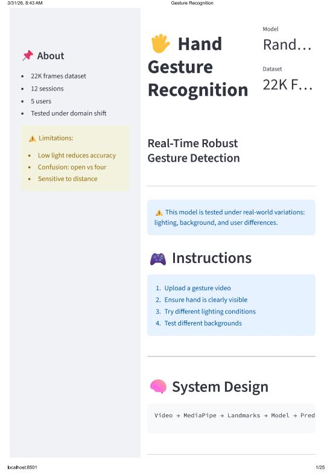
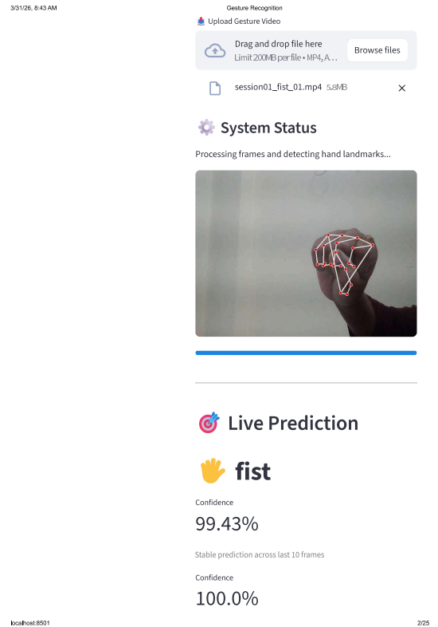

# 🖐️ Hand Gesture Recognition — Failure Analysis Under Real-World Conditions 
> Most gesture recognition systems report near-perfect accuracy.
> They break the moment you change the user, lighting, or background.

This project measures that failure — and explains why it happens.

---

## 🎥 Demo (Real Output)

<p align="center">
  
</p>

---

## 🚀 Key Highlights

- 📊 Evaluated across **12 sessions, 5 users, ~22K frames**
- 🔬 Designed **session-based validation** to prevent data leakage
- 📉 Quantified **real-world performance drop (100% → 88.4%)**
- ⚠️ Identified **failure modes under domain shift**
- 🎯 Focused on **generalization, not inflated accuracy**
  
---

## 🧠 Core Idea 

Instead of asking "How accurate is the model?", this project asks: 

**"When and why does the model fail?"**

---

## 🌐 Live Demo (Streamlit App)

👉 **Live App:**  
https://robust-hand-gesture-recognition-fwvdrm66ujac9ub2yz2vpd.streamlit.app/

### ⚠️ Important Note

Due to MediaPipe limitations in cloud environments:

- ❌ Live hand tracking may be disabled  
- ✅ Full real-time system works locally  

### ▶️ Run Locally

```bash
streamlit run streamlit_app.py
```

---

## 🖥️ Interface Preview

<p align="center">
  
</p>

<p align="center">
  
</p>

---

## 🖥️ App Capabilities

- Real-time gesture prediction from videos  
- Confidence scoring  
- Temporal smoothing for stable predictions  
- Hand landmark visualization  
- Processing metrics (frame count, detection rate)  

---

## 🎯 🧪 Evaluation Conditions 

- Lighting variation (bright, dim, natural)
- Background clutter (clean vs complex)
- Distance from camera (near vs far)
- User variation (different hand shapes)
  
---

## ⚠️ Limitations

- Minor performance drop in low light conditions 
- Confusion: open vs four  
- Sensitive to hand distance  

💡 Designed to expose real-world behavior, not just ideal performance.

---

## 🧠 System Architecture

```
Video → MediaPipe → Landmarks → Feature Engineering → Model → Prediction
```

---

## 💡 What Makes This Project Different?

Most projects:

- Use random train-test split  
- Report inflated accuracy  
- Ignore real-world deployment issues  

This project:

- ✅ Uses session-based validation  
- ✅ Evaluates domain shift explicitly  
- ✅ Includes failure analysis  
- ✅ Focuses on generalization, not memorization  

👉 This reflects how ML systems behave in real-world deployment, not ideal conditions.

---

## 🎯 Problem Statement

Most gesture recognition systems perform well in controlled environments but fail under:

- Different lighting conditions  
- Background variations  
- Distance changes  
- Different users and hand variations  

👉 This project evaluates performance under these challenges.

---

## 🚀 Solution

- Extracted **21 hand landmarks** using MediaPipe  
- Applied normalization for scale invariance  
- Trained a **Random Forest classifier**  
- Designed a **session-based evaluation strategy**  
- Measured performance under different real-world conditions  

---

## 📦 Dataset Design

- Total Sessions: **12**  
- Users: **5 individuals**  
- Gestures: **5 static classes (fist, open, index, four, small)**  
- Total Samples: **~22,000 frames**

### Data Collection Strategy

- Backgrounds: plain and cluttered indoor environments  
- Lighting Conditions: bright, dim, and natural light  
- User Variation: different hand shapes and sizes  
- Pose Variation: changes in hand position, orientation, and distance  

### Objective

The dataset is designed to evaluate gesture recognition performance under **real-world conditions**, rather than controlled environments.

---

## 🧪 Evaluation Strategy (Key Design)

🚨 Instead of random train-test splits, this project uses **session-based splitting**:

- Train and test data come from **different sessions**  
- Prevents **data leakage**  
- Simulates **real-world deployment scenarios**  
- Captures **domain shift across environments**  

This ensures performance reflects **true generalization**, not memorization.

---

## 📊 Results

- Overall Accuracy: **~93–94%**

### Robustness Evaluation

| Condition | Description | Accuracy |
|----------|------------|---------|
| Controlled Environment | Uniform background, consistent lighting, single user | 1.0000 |
| Moderate Variation | Slight lighting changes, simple background variations | 0.9999 |
| Challenging Conditions | Low light, cluttered background, multiple users, varying distances | 0.8842 |

📉 **Performance Drop:** ~12% under real-world conditions

### 🔬 Condition-wise Impact (Observed) 

| Factor | Impact on Accuracy | 
|------------------------------------|------------------| 
| Similar Gestures (open vs four) | ↓ major drop | 
| Small vs Fist Confusion | ↓ occasional drop | 
| Distance from Camera | ↓ moderate drop | 
| Lighting Variation | ↓ minor impact | 
| Background Clutter | ↓ minimal impact | 

👉 The primary limitation arises from gesture similarity rather than environmental variation.

### Summary Statistics

- Minimum Accuracy: **0.8842**  
- Maximum Accuracy: **1.0000**  
- Average Accuracy: **0.9614**

---

## 🧠 Key Insights

- Model performance is primarily limited by gesture similarity (open vs four)
- Feature representation struggles to separate similar finger configurations
- Lighting and background have less impact than expected
- Distance affects landmark precision moderately
- Random splits hide gesture-level confusion patterns
- Model limitations are driven more by feature ambiguity than environmental noise

---

## 📉 Confusion Matrix

<p align="center">
  
</p>

---

## ⚠️ Failure Analysis

- Confusion between **open** and **four** due to similar finger configurations  
- Reduced landmark stability in **low lighting conditions**  
- Performance degradation when hand occupies **smaller region of frame**  
- Sensitivity to **partial occlusions and motion blur**
- Major errors are caused by intrinsic gesture similarity rather than environmental noise  

---

## ⚠️ Failure Examples (Visual) 

<p align="center"> 
   
   
</p> 

Examples where the model struggles: 
- Similar gestures causing misclassification
- Reduced landmark precision at larger distances

---
## 💼 Why This Matters

This project analyzes how model performance shifts when evaluated across real-world variations rather than controlled settings.

It focuses on:

- Handling **domain shift**  
- Avoiding **data leakage**  
- Performing **failure analysis**  

👉 These are critical for production-level ML systems.

---

## 📂 Project Structure

```
robust-hand-gesture-recognition/
│
├── .streamlit/
│   └── config.toml  
│
├── streamlit_app.py
├── models/
│   └── gesture_model.pkl
│
├── src/
│   ├── extract_landmarks.py
│   ├── preprocess.py
│   ├── train_model.py
│   ├── evaluate.py
│   ├── evaluate_conditions.py
│   ├── realtime_inference.py
│   └── test_hand_detection.py
│
├── results/
│   ├── demo.gif
│   ├── confusion_matrix.png
│   ├── streamlit_ui_1.png
│   └── streamlit_ui_2.png
│
├── requirements.txt  
├── README.md
└── .gitignore
```

---

## ⚙️ How to Run

### 1. Clone repository

```bash
git clone https://github.com/sravani-engineer/robust-hand-gesture-recognition.git
cd robust-hand-gesture-recognition
```

### 2. Create virtual environment

```bash
python -m venv venv
venv\Scripts\activate
```

### 3. Install dependencies

```bash
pip install -r requirements.txt
```

### 4. Run Streamlit App

```bash
streamlit run streamlit_app.py
```

---

## 🔄 Pipeline

```
Video Input → Landmark Extraction → Preprocessing → Model Training → Evaluation → Real-time Inference
```
---

## 🔥 Key Takeaway 

High accuracy does not mean a reliable system. 

Real-world performance depends on robustness to changing conditions — and most models fail this test. 

---
